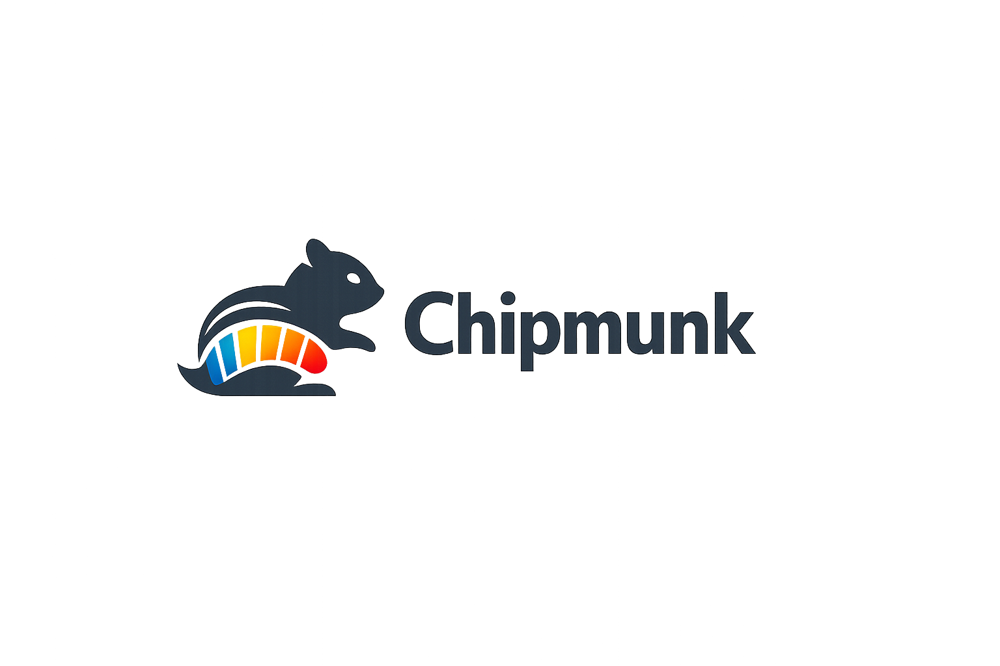
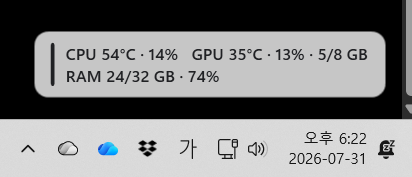

<h1 align="center">Chipmunk</h1>

<p align="center">
  <a href="https://github.com/kjh2159/Chipmunk/actions/workflows/dotnet.yml">
    
  </a>
</p>

<p align="center">
  
</p>

<p align="center">
  A lightweight real-time system monitoring widget for Windows 10 and Windows 11.
</p>

Chipmunk displays CPU, GPU, and memory information in a compact overlay positioned above the Windows taskbar.

It is designed to remain visible without interrupting normal desktop usage.

> Are you a developer? See the [Developer README](README-DEV.md).

## Features

- Real-Time Hardware Monitoring
- Taskbar Overlay Widget
- Customizable Display Settings and Language
- System Tray and Click-Through Mode
- Safe Sensor Access

The interface can be changed at runtime between English, Korean, Japanese, Simplified Chinese, and Spanish. Open **Settings → Language**, select a language, and choose **Apply**; no restart is required.

## Example
<p align="center">
  
</p>

> Unavailable sensor values are displayed as `N/A`. A missing or unsupported sensor will not terminate the application.


## System requirements

- Windows 10 version 19041 or later
- Windows 11
- x64 processor

The distributed application is self-contained, so users do not need to install the .NET runtime separately.

## Installation

1. Open the [latest release](https://github.com/kjh2159/Chipmunk/releases).
2. Download `Chipmunk-Setup-x64.exe`.
3. Run the installer.
4. Start Chipmunk from the Start menu or desktop shortcut.

The Chipmunk application itself does not normally require administrator privileges.
If PawnIO is installed but CPU temperature remains unavailable, Chipmunk can offer
an administrator restart for that session only. Windows will show a UAC prompt first.

## Getting started

When Chipmunk starts, the widget appears near the bottom-right corner of the selected monitor.

The system tray menu provides the following actions:

- Show or hide the widget
- Open the detailed monitor
- Open settings
- Rescan hardware sensors
- Enable or disable click-through mode
- Restore the default widget position
- Exit the application

You can drag the widget to reposition it. The position is restored automatically the next time Chipmunk starts.

Double-clicking the widget opens either Windows Task Manager or the detailed monitoring window, depending on the selected setting.

## Warning colors

Chipmunk changes the displayed color according to the configured thresholds.

Default temperature thresholds:

| State    |    Temperature |
| -------- | -------------: |
| Normal   |     Below 70°C |
| Warning  |        70–84°C |
| Critical | 85°C or higher |

Default usage thresholds:

| State    |         Usage |
| -------- | ------------: |
| Normal   |     Below 80% |
| Warning  |        80–94% |
| Critical | 95% or higher |

Thresholds can be changed from the settings window.
> For the future work, the font color of the states could be changeable.

<!-- ## CPU temperature and PawnIO

Some CPU temperature sensors require low-level hardware access that is not available to normal desktop applications.

If Chipmunk cannot read the CPU temperature and PawnIO is not installed, it may display an optional installation prompt.

Chipmunk will:

1. Explain why PawnIO may be required.
2. Ask for explicit consent.
3. Verify the bundled PawnIO installer using a pinned SHA-256 hash.
4. Request Windows UAC approval only after consent.
5. Continue working if the installation is declined or cancelled.

PawnIO is optional and is never installed automatically.

After installing PawnIO, exit and restart Chipmunk. If CPU temperature still appears as `N/A`, restart Windows once. -->

## Settings and logs

Settings are stored in:

```text
%LocalAppData%\Chipmunk\settings.json
```

Logs are stored in:

```text
%LocalAppData%\Chipmunk\Logs
```

If the settings file becomes corrupted, Chipmunk restores safe default settings automatically.

## Privacy

Chipmunk:

- Does not send telemetry
- Does not upload hardware information
- Does not require an account
- Does not perform runtime network communication

All monitoring and configuration data remains on the local computer.

## Uninstalling

Open:

```text
Windows Settings → Apps → Installed apps
```

Select **Chipmunk**, and then choose **Uninstall**.

If Windows startup was enabled from a portable copy, disable that option before deleting the portable directory.

## Troubleshooting and FAQ

### A. CPU temperature displays `N/A`

- Use **Rescan hardware sensors** from the tray menu.
- Restart Chipmunk.
- Install PawnIO only if Chipmunk offers it and you agree.
- Restart Windows after installing PawnIO.
- Check whether the CPU and motherboard expose temperature sensors.

### B. GPU values display `N/A`

- Install or update the GPU driver.
- Open settings and select the intended GPU.
- Rescan hardware sensors.
- Note that an inactive integrated GPU may not expose all sensor values.

### C. The widget is outside the visible screen

Use:

```text
System tray → Restore default position
```

### D. The widget does not accept mouse input

Disable **Click-through mode** from the system tray menu.

<!-- ## Known limitations

- Sensor availability varies by hardware and firmware.
- Some inactive GPUs do not expose temperature or memory sensors.
- Remote Desktop sessions may provide fewer hardware values.
- Windows may display an unknown-publisher warning until the Chipmunk installer is code-signed.
- The portable single-file package still requires its external dependency and notice files. -->

## Developer documentation

Architecture, source code structure, build instructions, testing, and packaging documentation are available in the [Developer README](README-DEV.md).

## License

Chipmunk is distributed under the terms described in [LICENSE](LICENSE).

Third-party licenses and notices are available in:

- [THIRD-PARTY-NOTICES.md](THIRD-PARTY-NOTICES.md)
- [PAWNIO-NOTICE.md](PAWNIO-NOTICE.md)
